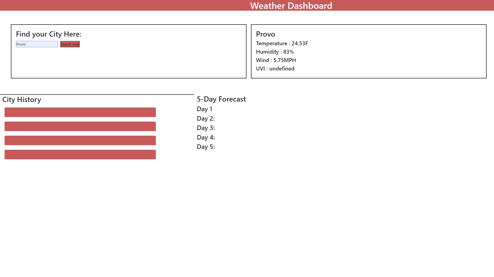

## Howsthatweather?

  
  
  ## Table of Contents
  -[Project Description](#projectDescription)
  -[Table of Contents](#tableofContents)
  -[Installation](#installation)
  -[Usage](#usage)
  -[License](#license)
  -[Contributing](#contributing)
  -[Tests](#tests)
  -[Questions](#questions)

  ## Project Description 
  An application to search for and show the weather for whatever city you like. With the potential to see your past search history and a look at a 5 day forecast.
  
  <href = "https://indiscreetgiraffe.github.io/howsthatweather/">

  
  
  
 
  ## Languages Used 
  Javascript,CSS,HTML.

  ### Installation Instructions
  Clone the repo and open with your preferred browser.

  ### What will the app be used for? 
  This application is used to search the weather.

  ### How can you contribute?
  Fork your own copy and do what you want with it!

  ### Tests 
  None

  ### Credits and Contributors 
  None

  ### License
  This application is covered under the Open license
  

  ### Questions
  -------------------------------------------------------------------------------------------------------
  
  Check me out on Github!: (https://github.com/IndiscreetGiraffe) 
  
  Any questions? Email at kikij432@gmail.com
